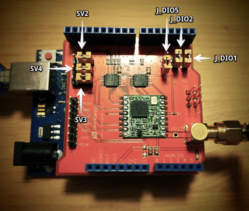

# Arduino UNO + Dragino LoRa Shield v1.3

## Prepare your hardware

- Plug dragino shield onto your Arduino
- Connect antenna
- Make sure jumpers are set as follows:
  - Jumpers `SV2`, `SV3` and `SV4`: right position
  - Jumpers `J_DIO1` and `J_DIO2`: closed
  - Jumpers `J_DIO5`: open

This is how it should look like:

## Setup your account on The Things Network

There are two ways to use the TTN backend: command-line (`ttnctl`) and web-based (`dashboard`).
We'll be using command-line instructions, but the web-based options should be self-explanatory based on these anyway.

- Download `ttnctl` ([download it again today](https://www.thethingsnetwork.org/wiki/Backend/ttnctl/QuickStart#quick-start-guide-for-ttnctl_installation), it updates often!)
- Create a user:

        $ ./ttnctl user create yourname@email.com

- Login with your newly created user:

        $ ./ttnctl user login yourname@email.com

- Create an [application](https://www.thethingsnetwork.org/wiki/Backend/Connect/Application) to interact with your devices:

        $ ./ttnctl applications create "Name of your application"

- List your applications:

        $ ./ttnctl applications

- Select the app you want to use:

        $ ./ttnctl applications use [AppEUI]

- Register a new device. We use ABP (activation by personalization) and a flag (`--relax-fcnt`) to make development easier:

        $ ./ttnctl help devices register personalized

- Write down the `DevAddr`, `AppSKey`, and `NwkSKey` that are returned by the previous command, because you will need them in the next step (you can always query those later as well).

## Setup up the your dev environment

- Install the [Arduino port of LMIC (LoRaMAC in C)](https://github.com/matthijskooijman/arduino-lmic) into your Arduino IDE:
  - Download the [library as a ZIP file](https://github.com/matthijskooijman/arduino-lmic/archive/master.zip).
  - On the Arduino IDE, go to `Sketch` -> `Include Library` -> `Add .ZIP Library...` and select the ZIP file.

## Code

We're finally ready to start coding on our Arduino UNO:

- Connect the Arduino to your computer using the USB cable
- Select your Arduino board: go to `Tools` -> `Board: ...` and select the one matching your board, e.g. `Arduino/Genuino Uno`.
- Select the port: go to `Tools` -> `Port: ...` and select the one where your board shows up, e.g. `/dev/cu.usbmodem1431 (Arduino/Genuino Uno)`.
- Open the `hello-world` example contained in this repository ([link](hello-world/hello-world.ino)).
- Remember the keys you wrote down on while setting up your TTN account? Now is the time to use them! Notice that `ttnctl` outputs `DevAddr` without the `0x` prefix, but you must add it for it to work.
- Upload and test it! :+1:
- You can see the data flowing in on the web-ui (TTN dashboard) immediately: just open the dashboard, open your application and see the messages from your node.
- Alternatively, use the command line to subscribe to messages:

        $ ./ttnctl subscribe

## Other examples

Start exploring the possibilities with the following code examples:

  - [hello-world](hello-world/hello-world.ino): the canonical example to get started. 
  - [send-sensor-data](send-sensor-data/send-sensor-data.ino): a simple example to send a single integer value from analog pins.
  - [controlling-arduino](controlling-arduino/controlling-arduino.ino): example using downlink messages to actuate your Arduino.
